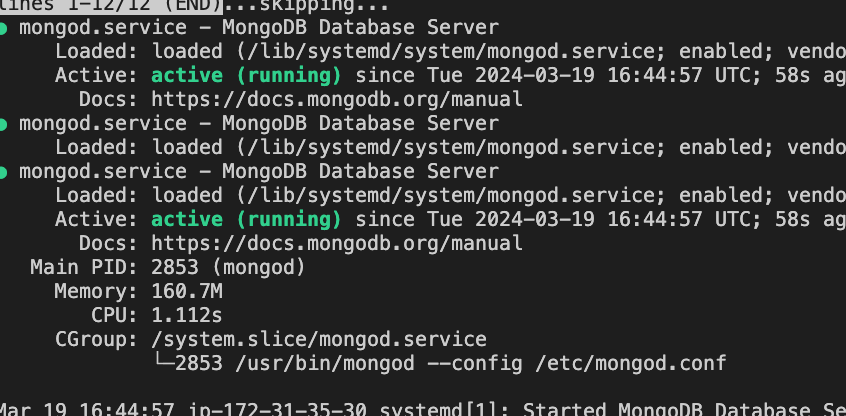
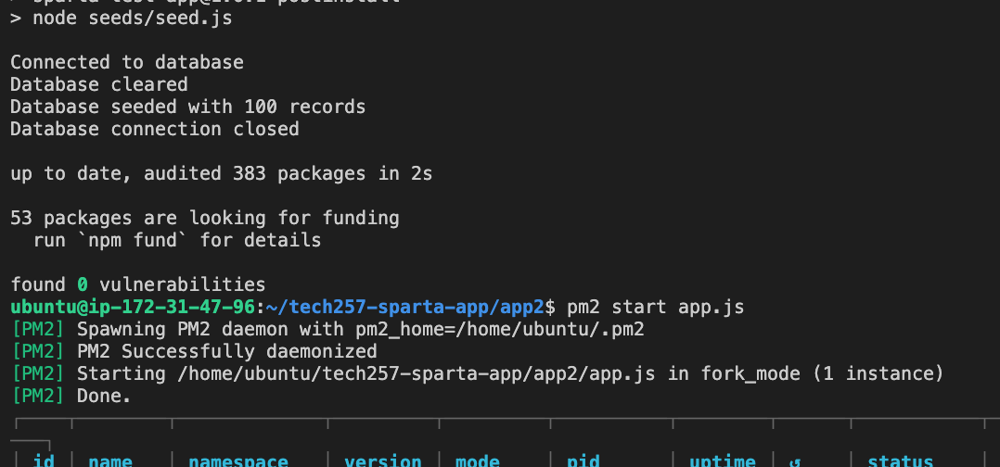
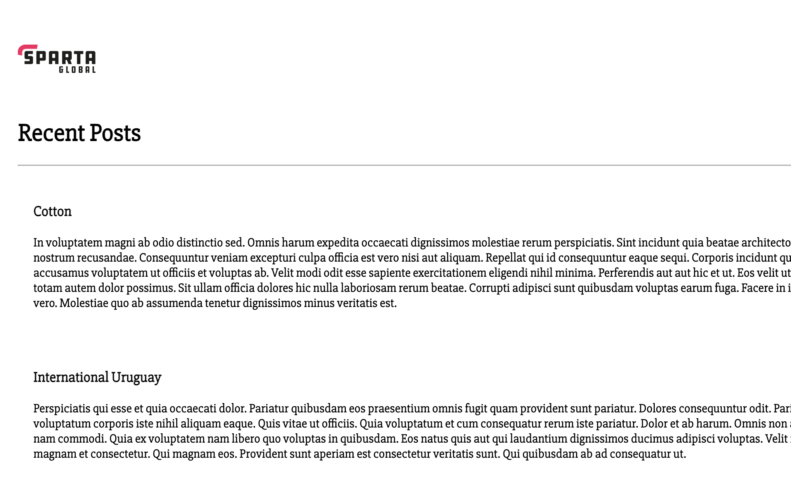

#  Deploy the sparta app on AWS


The service to create VM's on AWS is called Elastic Compute Cloud (EC2), they are scalable (hence elastic)

#  Creating an Instance
1. First we must pick an appropriate **name** for our ec2 instance.
2. Second, choose an image, for this I have used ubuntu 22.04


3. Choose the size of your instance via the **Instance Type**. In this example I have used a **t2micro**. The size is micro, the smallest aws offering and the instance family is called t2.
4. Next, choose a keypair.
5. Lastly, in **Network Settings* we can choose our subnets, vpc,security group rules, etc.
    rename your security group, add a description and rules. We made an instance, with security groups allowing port 80 and 22 for HTTP and SSH.


    Lastly, review on the right hand side and click to **launch** when you are ready.


We downloaded a pem file &then had to move it to .ssh
``` 
mv ~/Downloads/tech257.pem ~/.ssh/tech257.pem
 ``` 

once there we change the permissions
``` 
chmod 400 tech257.pem
``` 

# 1. ssh in
1. Select your Instance ID to get an overview of your instance.
2. Choose **Connect** and select the *SSH* option
3. Copy & paste the ssh link to you terminal within .ssh to enter ec2 instance.


# Manually getting app working

## Updates and Upgrades

``` 
# Update
sudo apt update -y

#  upgrade for bypassing user input
sudo DEBIAN_FRONTEND=noninteractive apt-get upgrade -yq
``` 

## Update config file

this is specific to ubuntu 22.04
sudo vim /etc/needrestart/needrestart.conf
change this:
#$nrconf{restart} = 'i';
to this:
$nrconf{restart} = 'a';

reload config file
sudo sysctl -p


## Running rest of commands
``` 
# Install nginx
sudo apt install -y nginx

#reverse proxy 
sudo sed -i "s|try_files .*;|proxy_pass http://127.0.0.1:3000;|g" /etc/nginx/sites-available/default

# Restart nginx
sudo systemctl restart nginx

# Enable nginx
sudo systemctl enable nginx


# Git Clone
git clone https://github.com/Scarlett100/tech257-sparta-app.git

# Install Node.js and npm
curl -sL https://deb.nodesource.com/setup_20.x | sudo -E bash -
sudo apt-get install -y nodejs

# CD into app2 folder
cd tech257-sparta-app/app2

# Install npm dependencies
npm install

# Start npm (can also use node.js)
#npm start <-- not needed if doing pm2, because script will never reach pm2 if npm is started.

# Install pm2
sudo npm install pm2@latest -g

#stopPm2 before rerunning.
pm2 kill

# Start app with pm2
pm2 start app.js

``` 

App is working:


app works on desktop


Differences to how I did on azure:

This time I cloned in home directory and did a pm2 kill.


# Automated - not currently working

Now I will try to automate the process:


``` 

# update config file
sed -i "s/#\$nrconf{restart} = 'i';/\$nrconf{restart} = 'a';/" /etc/needrestart/needrestart.conf

# Update
sudo apt update -y

#  upgrade for bypassing user input
sudo DEBIAN_FRONTEND=noninteractive apt-get upgrade -yq


#  reload config file
sudo sysctl -p

# Install nginx
sudo apt install -y nginx

# reverse proxy 
sudo sed -i "s|try_files .*;|proxy_pass http://127.0.0.1:3000;|g" /etc/nginx/sites-available/default

# Restart nginx
sudo systemctl restart nginx

# Enable nginx
sudo systemctl enable nginx

# Git Clone
git clone https://github.com/Scarlett100/tech257-sparta-app.git

# Install Node.js and npm
curl -sL https://deb.nodesource.com/setup_20.x | sudo -E bash -
sudo apt-get install -y nodejs

# CD into app2 folder
cd tech257-sparta-app/app2

# Install npm dependencies
npm install

# Start npm (can also use node.js)
#npm start <-- not needed if doing pm2, because script will never reach pm2 if npm is started.

# Install pm2
sudo npm install pm2@latest -g

#stopPm2 before rerunning.
pm2 kill

# Start app with pm2
pm2 start app.js

``` 

# 2 tier deployment
Now we link the db and the app to create a 2 tier deployment!

First we create a db vm:
*  With default settings
*  Our security group will allow port 22 for ssh and port 27017 for MongoDB.
<br>


Once created, ssh into the ec2 instance.

Next, we run the following commands, I did so manually.

``` 
# run an update
sudo apt update -y

# run an upgrade
sudo DEBIAN_FRONTEND=noninteractive apt-get upgrade -yq


# vim into the config file to stop need for restarts (remember this is just for ubuntu 22.04)
sudo vim /etc/needrestart/needrestart.conf


#change this:
#$nrconf{restart} = 'i';
#to this:
$nrconf{restart} = 'a';

# get our key and download mongodb
curl -fsSL https://www.mongodb.org/static/pgp/server-7.0.asc |   sudo gpg -o /usr/share/keyrings/mongodb-server-7.0.gpg   --dearmor


# creates list file
echo "deb [ arch=amd64,arm64 signed-by=/usr/share/keyrings/mongodb-server-7.0.gpg ] https://repo.mongodb.org/apt/ubuntu jammy/mongodb-org/7.0 multiverse" | sudo tee /etc/apt/sources.list.d/mongodb-org-7.0.list

# update again
sudo apt-get update -y

# Install MongoDB
sudo apt-get install -y mongodb-org=7.0.6 mongodb-org-database=7.0.6 mongodb-org-server=7.0.6 mongodb-mongosh=2.1.5 mongodb-org-mongos=7.0.6 mongodb-org-tools=7.0.6

# change the bind ip
sudo sed -i 's@127.0.0.1@0.0.0.0@' /etc/mongod.conf

# restart mongodb
sudo systemctl restart mongod

# enable mongod
sudo systemctl enable mongod

# check mongod status
sudo systemctl status mongod

``` 

Once inputted all commands should get the below:




#  Connect with the app

Now, it is time to connect the two. In a fresh terminal ssh into the app vm(its likely you already have it up and running, if not get app running first)

In app vm run the following:

#!/bin/bash
# contrary to what we did before, I was advised to put public ip
export DB_HOST=mongodb://3.254.50.234:27017/posts
# print host!
printenv DB_HOST
# get into right path
cd tech257-sparta-app/app2
# kill the process
pm2 kill
# run an npm install <-- make sure not sudo
npm install
#start processes
pm2 start app.js


You should now see this command below, to note that you connected, the db has seeded and now the db is closed.<br>


If you go to you  <app_vm_ip>/posts you should now get the below to show that the database and app have connected. <br>

